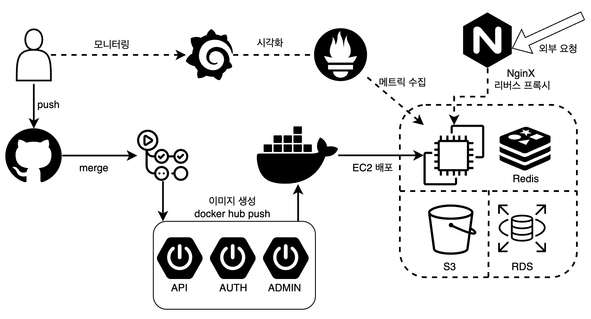
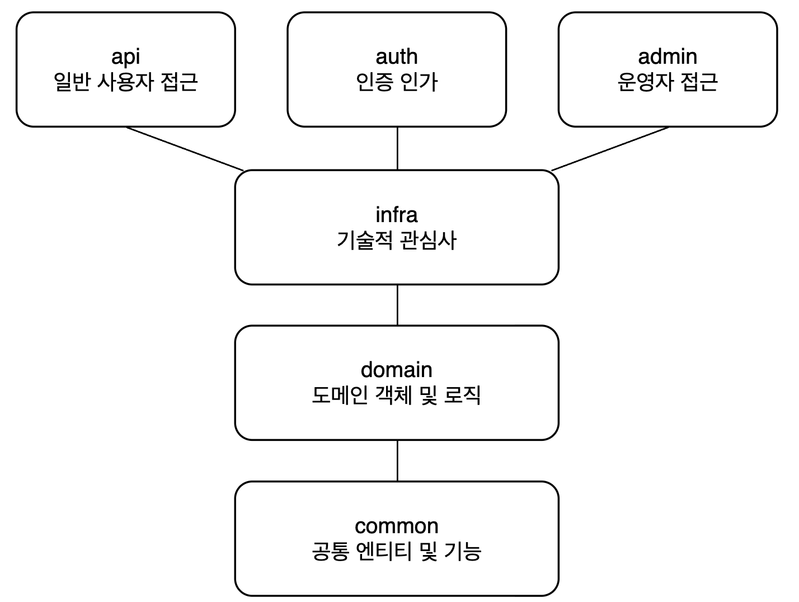

# Code Convention 📝
## Branch Naming Convention
- `main` : 배포 브랜치
- `dev` : 개발 브랜치
- `feature/{feature-name}` : 새로운 기능 개발 브랜치
- `refactor/{refactor-name}` : 코드 리팩토링 브랜치
- `fix/{bug-name}` : 버그 수정 브랜치
- `hotfix/{hotfix-name}` : 긴급 수정 브랜치

## Commit Message Convention
Commit 메시지는 `타입: 내용` 형식으로 작성합니다.

### Commit Type
- **feat** : 새로운 기능 추가
- **fix** : 버그 수정
- **refactor** : 코드 리팩토링 (기능 변경 없음)
- **docs** : 문서 수정 (README 등)
- **test** : 테스트 코드 추가/수정
- **chore** : 기타 변경사항 (빌드, 패키지 매니저 설정 등)
- **style** : 코드 스타일 수정 (세미콜론 추가, 들여쓰기 등)
- **perf** : 성능 개선

<hr>

# Contributors 🧑🏻‍💻
|**Server**|                                                 **Server**                                                 |                                                **Server**                                                 |                                                 **Server**                                                 |
|:--------------------------------------------------------------------------------------------------:|:----------------------------------------------------------------------------------------------------------:|:---------------------------------------------------------------------------------------------------------:|:----------------------------------------------------------------------------------------------------------:|
| [](https://github.com/minjo-on) | [](https://github.com/SD-gif) |     [](https://github.com/fbehddn)      | [](https://github.com/LeeShinHaeng) |
|                               [**박민준**](https://github.com/minjo-on)                               |                                 [**서동준**](https://github.com/SD-gif)                                 |                 [**유동우**](https://github.com/fbehddn)                                                     |                                   [**이신행**](https://github.com/LeeShinHaeng)                                    |


<hr>

# Tech Stacks 📚



<hr>

# Architecture 🏗

```
.
├── admin          // 관리자 기능 관련 엔드포인트 및 비즈니스로직 
│   ├── src
│   │   └── ...
│   ├── buid.gradle
│   └── Dockerfile
├── api            // 일반 사용자 기능 관련 엔드포인트 및 비즈니스로직 
│   ├── src
│   │   └── ...
│   ├── buid.gradle
│   └── Dockerfile
├── auth           // 인증 및 인가 관련 엔드포인 및 비즈니스 로직
│   ├── src
│   │   └── ...
│   ├── buid.gradle
│   └── Dockerfile
├── common         // 공통 엔티티 및 기능 (로깅, 예외 처리 등)
│   ├── src
│   │   └── ...
│   └── buid.gradle
├── domain         // 도메인 로직
│   ├── src
│   │   └── ...
│   └── buid.gradle
├── infra     // JPA Redis 등 기술적 관심사
│   ├── src
│   │   └── ...
│   └── buid.gradle
// ..

```



<hr>